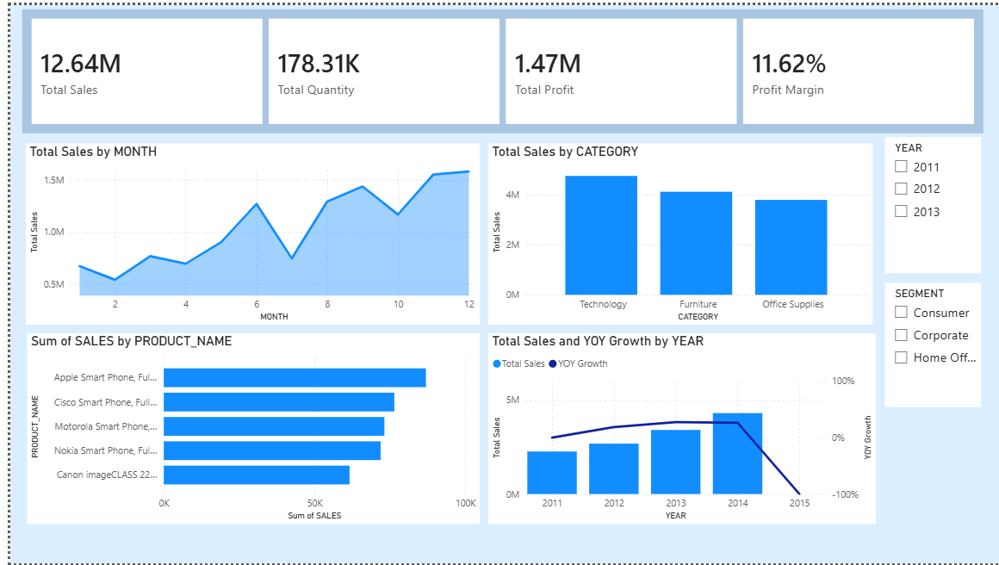

# Superstore Sales Data Pipeline using Databricks and Delta Lake

## Project Overview

This project demonstrates the implementation of a **Medallion Architecture (Bronze, Silver, Gold)** using **Databricks and Delta Lake** on the Superstore Sales dataset.

The goal is to build a structured and reliable data pipeline that transforms raw transactional data into analytics-ready datasets for business intelligence and reporting.

---

## Architecture Pattern

This project follows the **Medallion Architecture** pattern:

Bronze → Raw data ingestion  
Silver → Data cleaning and transformation  
Gold → Business-ready analytical data

This layered architecture improves **data quality, reliability, and scalability** for downstream analytics and reporting.

---

## Dataset

The source dataset is a **CSV file containing Superstore sales data** with the following schema:

| Column Name | Data Type | Description |
|-------------|-----------|-------------|
| order_id | string | Unique identifier for each order |
| order_date | date | Date when the order was placed |
| ship_date | date | Date when the order was shipped |
| ship_mode | string | Shipping method used |
| customer_name | string | Name of the customer |
| segment | string | Customer segment classification |
| state | string | State of the customer |
| country | string | Country of the customer |
| market | string | Market region |
| region | string | Regional classification |
| product_id | string | Unique identifier for each product |
| category | string | Product category |
| sub_category | string | Product sub-category |
| product_name | string | Name of the product |
| sales | double | Sales value of the transaction |
| quantity | integer | Number of items ordered |
| discount | double | Discount applied |
| profit | double | Profit generated from the order |
| shipping_cost | double | Cost incurred for shipping |
| order_priority | string | Priority level of the order |
| year | integer | Year of the order |

---

## Architecture

The data pipeline follows the **Medallion Architecture** pattern to progressively refine and structure the data.

### Bronze Layer – Raw Data Ingestion

The raw dataset is ingested into the Bronze layer with minimal transformation.

An additional metadata column `ingested_date` is added to improve data auditability.

Key characteristics:

- Raw data stored as-is
- Metadata column added for ingestion tracking
- Stored as **Delta tables** in Databricks

---

### Silver Layer – Data Cleaning and Standardization

In the Silver layer, the Bronze data is transformed to improve data quality and consistency.

Transformations performed:

- Data standardization
- Handling missing values
- Removing duplicate records
- Validating data against the raw dataset
- Adding metadata column `processed_at` using the current timestamp

The cleaned dataset is then stored again as **Delta tables**.

---

### Gold Layer – Data Modeling

In the Gold layer, the cleaned data is integrated and modeled using a **Star Schema** to support analytical workloads.

Data modeling steps:

- Data integration
- Normalization
- Creation of fact and dimension tables
- Optimization for analytics and reporting

The following tables were created and stored in a Databricks database as **Delta tables**:

| Table Name | Type | Description |
|------------|------|-------------|
| customer_dim | Dimension | Stores customer-related information |
| order_dim | Dimension | Contains order-level details |
| product_dim | Dimension | Product catalog and category information |
| market_dim | Dimension | Market and regional information |
| date_dim | Dimension | Date table used for time intelligence calculations |
| sales_fact | Fact | Central fact table containing sales transactions |

The fact table is connected to dimension tables using surrogate keys to enable efficient analytical queries.

---

## Data Storage

All tables are stored in **Delta Lake format** within Databricks to support:

- ACID transactions
- Schema enforcement
- Efficient querying
- Reliable data versioning

---

## Tech Stack

The following technologies and tools were used to build this data pipeline and analytics workflow.

| Category | Tools / Technologies |
|----------|----------------------|
| Data Platform | Databricks |
| Storage Layer | Delta Lake |
| Data Processing | PySpark |
| Data Modeling | Star Schema |
| Query Language | SQL (Databricks SQL, Snowflake SQL) |
| Data Visualization | Power BI |
| Version Control | Git, GitHub |

---

## Project Structure

The repository is organized to clearly separate notebooks, datasets, and documentation.

```
superstore-data-pipeline/
│
├── data
│   └── raw
│       └── superstore_sales.csv
│
├── notebooks
│   ├── 01_data_ingestion_bronze.ipynb
│   ├── 02_data_transformation_silver.ipynb
│   └── 03_data_integration_gold.ipynb
│
├── sql
│   ├── ddl.sql
│   ├── dml.sql
│   └── sales_analytics.sql
│
├── images
│   └── image.png
│
├── README.md
```

### Directory Description

**data/raw**  
Contains the original raw dataset used for the project.

**notebooks**  
Contains Databricks notebooks implementing the Medallion Architecture layers:

- Bronze: Data ingestion and raw data storage
- Silver: Data cleaning and transformation
- Gold: Data modeling and creation of fact and dimension tables

**documentation**  
Optional project documentation describing architectural decisions and design notes.

---

## Data Pipeline Workflow

The end-to-end workflow implemented in this project follows these steps:

1. Raw CSV dataset is ingested into the **Bronze layer** in Databricks.
2. Bronze data is cleaned and standardized in the **Silver layer**.
3. Silver data is transformed and modeled into a **Star Schema** in the **Gold layer**.
4. Gold tables are queried in Snowflake for **Exploratory and analytical processing**.
5. The final curated dataset is connected to **Power BI for dashboard creation and storytelling**.

---

## Business Questions Answered

The Gold layer enables answering key business questions such as:

- What is the total sales and profit?
- Which customer segments are the most profitable?
- How do sales trends vary over time?
- Which regions contribute the most to overall sales?
- What is the impact of discounts on profit?
- What are the top-selling products?
- Who are the high-value customers (top 20%)?
- What is the correlation between profit and discount?
- What is the average profit margin per category?
- What is the year-over-year (YoY) growth?
- What is the customer RFM (Recency, Frequency, Monetary) distribution?
- How does region-wise sales compare with profit efficiency?

---

## Snowflake Analytics

After building the Medallion Architecture in Databricks and creating Gold layer Delta tables, the curated data was migrated to **Snowflake** for analytical processing.

This section contains:

- **DDL:** Table creation scripts in Snowflake
- **DML:** Data loading scripts from CSVs into Snowflake tables
- **Analytical Queries:** SQL queries for business insights, reporting, and advanced analytics

---

### Snowflake DDL

The following tables were created in Snowflake to replicate the Gold layer structure:

- `customer_dim`
- `order_dim`
- `product_dim`
- `market_dim`
- `date_dim`
- `sales_fact`

**Example DDL for `customer_dim`:**

```sql
create or replace table customer_dim (
    customer_id integer not null primary key,
    customer_name varchar,
    segment varchar,
    country varchar,
    state varchar
);
```

## Power BI Integration

After performing analytical queries in Snowflake, the database was connected to Power BI Desktop to build an interactive dashboard.

**Workflow**

1. Connected Snowflake database to Power BI Desktop
2. Imported Gold layer tables into Power BI
3. Established relationships using the Star Schema
4. Created DAX measures for business metrics
5. Built an interactive dashboard for insights and storytelling

**Dashboard Features**

1. KPI Cards (Sales, Profit, YoY Growth)
2. Time-based analysis using Date Dimension
3. Region-wise and Segment-wise performance
4. Profit vs Discount analysis
5. Top products
6. Year and YOY growth calculation
7. Interactive slicers (Year, Category)

**Dashboard**


## Key Highlights

- End-to-end Data Engineering + Analytics project
- Implementation of Medallion Architecture
- Integration of Databricks, Snowflake, and Power BI
- Star Schema data modeling for analytics
- Interactive dashboard with business insights

This integration completes the end-to-end data pipeline by enabling business users to explore insights through interactive visualizations and data storytelling.
